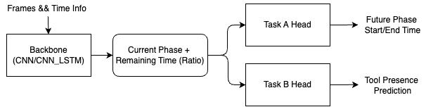
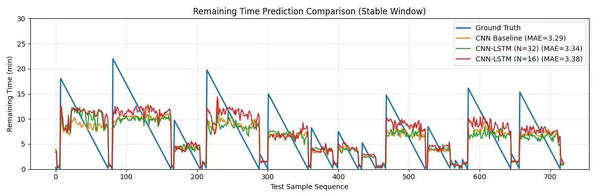

# Temporal Surgical Workflow Prediction

[中文文档](README.zh-CN.md)

This repository implements a PyTorch pipeline for temporal surgical workflow prediction on Cholec80-style laparoscopic cholecystectomy data. It compares a frame-aggregated CNN baseline with CNN-LSTM temporal models and evaluates how input window length affects workflow prediction stability.

The workflow covers three connected objectives:

- Current surgical phase classification.
- Remaining time regression for the current phase.
- Downstream timeline and tool-presence prediction from phase/time context.

## Highlights

- Cholec80 frame, phase, and tool annotation loaders with a fixed train/val/test split of 40/10/30 videos.
- CNN and CNN-LSTM backbones trained with a multi-task loss for phase classification and normalized remaining-time regression.
- Separate output heads for future phase timeline estimation and multi-label tool recognition.
- Experiment artifacts saved as configs, logs, checkpoints, curves, JSON metrics, and optional visualization data.
- Reproducible command-line entry points for training, testing, and comparison.

## Quick Start Index

| Need | Command |
| --- | --- |
| Code structure check | `bash scripts/check_project.sh` |
| Reuse shared conda env | `conda run -n codex_python bash scripts/check_project.sh` |
| Run lightweight tests | `conda run -n codex_python pytest tests/ -q` |
| Inspect phase patterns | `python checkdata.py --phase_dir data/cholec80/phase_annotations --output outputs/phase_transition_patterns.png` |
| Train a backbone | `python train_backbone.py --name backbone_cnn --epochs 25 --model cnn` |

## Method Overview

The backbone receives a sliding temporal window of sampled video frames. A CNN extracts per-frame visual features. The CNN baseline averages those features across time, while the CNN-LSTM model uses the final LSTM state as the temporal representation. The shared representation is optimized for phase classification and current-phase remaining-time regression.



The output heads use the predicted phase and remaining-time context to estimate future phase boundaries and tool presence. This keeps visual representation learning separate from lightweight structured prediction heads.

## Repository Layout

```text
.
|-- README.md
|-- README.zh-CN.md
|-- requirements.txt
|-- checkdata.py                 # Phase transition pattern analysis
|-- general_compare_diagram.py   # Remaining-time comparison plot
|-- model_backbone.py            # CNN and CNN-LSTM backbone models
|-- model_out_head.py            # Timeline and tool output heads
|-- taskA_data_loader.py         # Phase/time dataset loader
|-- taskB_data_loader.py         # Phase/time/tool dataset loader
|-- test_backbone.py             # Backbone evaluation
|-- test_taskA_out_head.py       # Timeline-head pipeline evaluation
|-- test_taskB_out_head.py       # Tool-head pipeline evaluation
|-- train_backbone.py            # Backbone training
|-- train_taskA_out_head.py      # Timeline-head training
|-- train_taskB_out_head.py      # Tool-head training
`-- picture/
    |-- compare.jpg
    `-- train_pipeline.png
```

## Environment

Python 3.10 is recommended.

One-command setup:

```bash
bash scripts/setup_env.sh
```

Quick code-structure check:

```bash
bash scripts/check_project.sh
```

To reuse a shared conda environment:

```bash
conda run -n codex_python bash scripts/check_project.sh
```

Manual setup:

```bash
python -m venv .venv
source .venv/bin/activate
python -m pip install --upgrade pip
pip install -r requirements.txt
```

Install the PyTorch build that matches the local CUDA or CPU runtime if the default package index does not match the target machine.

## Dataset

The code expects the Cholec80 data to be prepared locally. Dataset files are not included in this repository.

Prepare the dataset with the CAMMA TF-Cholec80 scripts:

```bash
git clone https://github.com/CAMMA-public/TF-Cholec80.git
cd TF-Cholec80
python prepare.py --data_rootdir /absolute/path/to/datasets
```

`prepare.py` downloads and extracts Cholec80 to `/absolute/path/to/datasets/cholec80`. The official script also supports `--verify_checksum` for archive verification and `--keep_archive` if the downloaded archive should be retained after extraction. Make sure enough disk space is available before running the download and extraction step.

After preparation, either pass the extracted directory explicitly:

```bash
python train_backbone.py \
  --name backbone_cnn \
  --epochs 25 \
  --model cnn \
  --data_root /absolute/path/to/datasets/cholec80
```

Or link/copy it to the default location expected by this repository:

```bash
mkdir -p data
ln -s /absolute/path/to/datasets/cholec80 data/cholec80
```

Expected layout:

```text
data/cholec80/
|-- frames/
|   |-- video01/
|   |-- video02/
|   `-- ...
|-- phase_annotations/
|   |-- video01-phase.txt
|   |-- video02-phase.txt
|   `-- ...
`-- tool_annotations/
    |-- video01-tool.txt
    |-- video02-tool.txt
    `-- ...
```

If using the CAMMA TF-Cholec80 preparation scripts, place the prepared output under `data/cholec80` or pass a custom path with `--data_root`.

Inspect phase-transition patterns:

```bash
python checkdata.py \
  --phase_dir data/cholec80/phase_annotations \
  --output outputs/phase_transition_patterns.png
```

## Training

Train a CNN backbone:

```bash
python train_backbone.py \
  --name backbone_cnn \
  --epochs 25 \
  --model cnn
```

Train CNN-LSTM backbones with different temporal windows:

```bash
python train_backbone.py \
  --name backbone_cnn_lstm_16 \
  --epochs 25 \
  --model cnn_lstm \
  --seq_len 16 \
  --stride 8

python train_backbone.py \
  --name backbone_cnn_lstm_32 \
  --epochs 25 \
  --model cnn_lstm \
  --seq_len 32 \
  --stride 16
```

Train the structured output heads:

```bash
python train_taskA_out_head.py \
  --name timeline_head_16 \
  --epochs 25 \
  --seq_len 16 \
  --stride 8

python train_taskB_out_head.py \
  --name tool_head_16 \
  --epochs 25 \
  --seq_len 16 \
  --stride 8
```

Training writes artifacts to `checkpoints/<experiment_name>/`, including:

- `best.pth`
- `config.json`
- `train.log`
- `training_curve.png` for backbones
- `loss_curve.png` for output heads

## Evaluation

Evaluate a trained backbone:

```bash
python test_backbone.py \
  --name backbone_cnn_lstm_16 \
  --model cnn_lstm \
  --seq_len 16 \
  --stride 8
```

Evaluate the timeline pipeline with a trained backbone and timeline head:

```bash
python test_taskA_out_head.py \
  --backbone_name backbone_cnn_lstm_16 \
  --backbone_model cnn_lstm \
  --head_name timeline_head_16 \
  --seq_len 16 \
  --stride 8
```

Evaluate the tool-recognition pipeline:

```bash
python test_taskB_out_head.py \
  --backbone_name backbone_cnn_lstm_16 \
  --backbone_model cnn_lstm \
  --head_name tool_head_16 \
  --seq_len 16 \
  --stride 8
```

Evaluation writes `test.log` and `test_result.json` to the relevant checkpoint directory. The timeline evaluation also writes `future_timeline_data.npz`.

## Metrics

- Backbone evaluation reports phase accuracy, remaining-time MAE in seconds, and R2 for current-phase remaining-time prediction.
- Timeline-head evaluation reports phase accuracy, start-time MAE, end-time MAE, and R2 over valid future timeline points.
- Tool-head evaluation reports tool accuracy, micro-F1, and macro-F1 for multi-label tool presence.

## Temporal Window Comparison

`general_compare_diagram.py` compares multiple trained backbones on the same test subset and plots remaining-time predictions against ground truth. Update the `MODELS` list at the top of the file if experiment names differ from the defaults.

```bash
python general_compare_diagram.py \
  --data_root data/cholec80 \
  --save_dir checkpoints \
  --output outputs/remaining_time_comparison.png
```

An example comparison figure is included at `picture/compare.jpg`.



## Reproducibility Notes

- Scripts set Python, NumPy, and PyTorch random seeds through `--seed`.
- CUDA falls back to CPU automatically when a CUDA device is unavailable.
- Frames are sampled at 1 FPS by reading every 25th annotation entry.
- The default split uses videos `1-40` for training, `41-50` for validation, and `51-80` for testing after lexicographic sorting of video folders.
- `data/`, `checkpoints/`, and generated output folders are excluded from version control.

## Main Arguments

| Argument | Used by | Default | Description |
| --- | --- | --- | --- |
| `--name` | training scripts, `test_backbone.py` | required | Experiment name and checkpoint subdirectory |
| `--epochs` | training scripts | required | Number of training epochs |
| `--model` | backbone train/test | required | `cnn` or `cnn_lstm` |
| `--backbone_name` | output-head tests | required | Backbone checkpoint directory |
| `--head_name` | output-head tests | required | Output-head checkpoint directory |
| `--backbone_model` | output-head tests | required | Backbone architecture used by the checkpoint |
| `--data_root` | all training/testing scripts | `data/cholec80` | Dataset root |
| `--batch_size` | all training/testing scripts | `16` | Batch size |
| `--lr` | training scripts | `1e-4` | Adam learning rate |
| `--seq_len` | sequence scripts | `16` | Number of frames per temporal window |
| `--stride` | sequence scripts | `8` | Sliding-window stride |
| `--num_workers` | data loaders | `8` | DataLoader worker count |
| `--save_dir` | backbone train/test, comparison | `checkpoints` | Artifact root |
| `--device` | all training/testing scripts | `cuda` | Requested device |
| `--seed` | all training/testing scripts | `42` | Random seed |

## Result Snapshot

| Experiment | Metric focus | Included evidence |
| --- | --- | --- |
| CNN baseline | Current phase accuracy and remaining-time MAE | training and test scripts |
| CNN-LSTM temporal model | Stability across 16/32-frame windows | `picture/compare.jpg` |
| Structured output heads | Future timeline and tool-presence prediction | head training/evaluation scripts |
