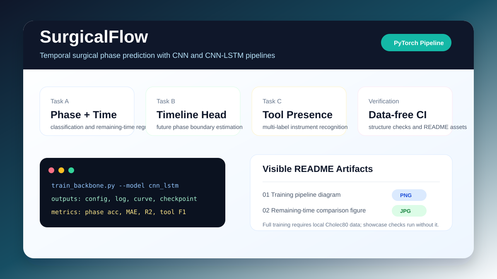

# SurgicalFlow

[中文](README.md)

SurgicalFlow is a PyTorch surgical workflow prediction project for Cholec80-style laparoscopic cholecystectomy data. It includes CNN, CNN-LSTM, timeline prediction heads, and tool-recognition heads.



## Features

- Reads surgical frames, phase annotations, and tool annotations.
- Trains CNN or CNN-LSTM backbone models.
- Predicts current phase, current-phase remaining time, future phase timeline, and tool usage.
- Outputs logs, curves, checkpoints, and JSON metrics.

## Results

| Item | Content |
| --- | --- |
| Tasks | phase classification, remaining-time regression, timeline prediction, tool recognition |
| Models | CNN baseline, CNN-LSTM |
| Method figure | `picture/train_pipeline.png` |
| Comparison figure | `picture/compare.jpg` |


## Quick Start

Check the project structure:

```bash
bash scripts/check_project.sh
```

Reuse an existing conda environment:

```bash
conda run -n codex_python bash scripts/check_project.sh
```

Training example:

```bash
python train_backbone.py --name backbone_cnn --epochs 25 --model cnn --data_root data/cholec80
```

## Requirements

- Python 3.10+
- PyTorch
- Dependencies listed in `requirements.txt`

## Data Notes

- The Cholec80 dataset is not included in this repository.
- The default data path is `data/cholec80`.
- Full training and evaluation require local `frames/`, `phase_annotations/`, and `tool_annotations/` directories.

## Project Layout

```text
model_backbone.py          CNN and CNN-LSTM backbones
model_out_head.py          Timeline and tool output heads
taskA_data_loader.py       Phase/time data loader
taskB_data_loader.py       Phase/time/tool data loader
train_*.py                 Training scripts
test_*.py                  Evaluation scripts
picture/                   Method and result figures
tests/                     Lightweight tests
scripts/                   Check scripts
```

## Tests

```bash
pytest tests/ -q
```
